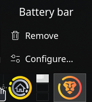

# Battery bar for KDE Plasma
## Description
This plasmoid adds a battery bar to a horizontally oriented panel in KDE Plasma.
Add it to the very beginning of a panel or place it in a spot of choosing and adjust the offset in config.

## Screenshots

## Usage
This plasmoid adds a battery bar to a horizontally oriented panel in KDE Plasma.
The trick used here is an overflow of the QML widget's elements into its container. The battery bar is a simple rectangle, however it is significantly larger than the container advertised to KDE Plasma. That means, that for the plasmoid to work, it **must** be placed at the very beginning of a horizontal panel that fills the entire screen. The container's size is determined by the value of a spinbox marked *Spacer width* in the configuration. Do not set it too low to avoid problems with clicking on the applet when in edit mode.

The applet adds two battery bars:
- main bar (green by default) - fills the screen based on the percentage of power left in the battery,
- auxillary bar (red by default) - its length represents the battery percentage that will be used during the next hour (by default) at current power draw.

Simple animations are provided:
- when the battery is charging the main bar slowly breathes once in a while,
- whenever the charger is disconnected several bubbles will be shown to escape the main bar to the right,
- when the charger is connected a swift bright flash will travel through the main bar from left to right.

## Installation
### Local
Install the .plasmoid file in the releases of this repo.
### Global (Arch-based)
A *PKGBUILD* is provided within this repo (in releases) to install this plasmoid globally on Arch based distros.
