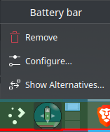

# Battery bar for KDE Plasma
## Description
This plasmoid adds a battery bar to the background of a KDE Plasma panel.
Add it to the beginning of a panel or place it in a spot of choosing and adjust the offset accordingly in the config.

## Screenshots

## Usage
The trick used is an overflow of the QML widget's elements into its container. The applet itself is a small rectangle, however the bars are significantly larger than the container advertised to KDE Plasma. The container's size can be modified via a setting called *Container size* to create a separator of adjustable width.

The applet adds two battery bars:
- main bar (green by default) - fills the screen based on the percentage of power left in the battery,
- auxillary bar (red by default) - its length represents the battery percentage that will be used during the next hour (by default) at current power draw.

Simple animations are provided:
- when the battery is charging the main bar slowly breathes once in a while,
- whenever the charger is disconnected several bubbles will be shown to escape the main bar to the right,
- when the charger is connected a swift bright flash will travel through the main bar from left to right.

## Installation
### Local
Install the *.plasmoid* file in the releases of this repo.
### Global (Arch-based)
A *PKGBUILD* is provided within this repo (in releases) to install this plasmoid globally on Arch based distros.
